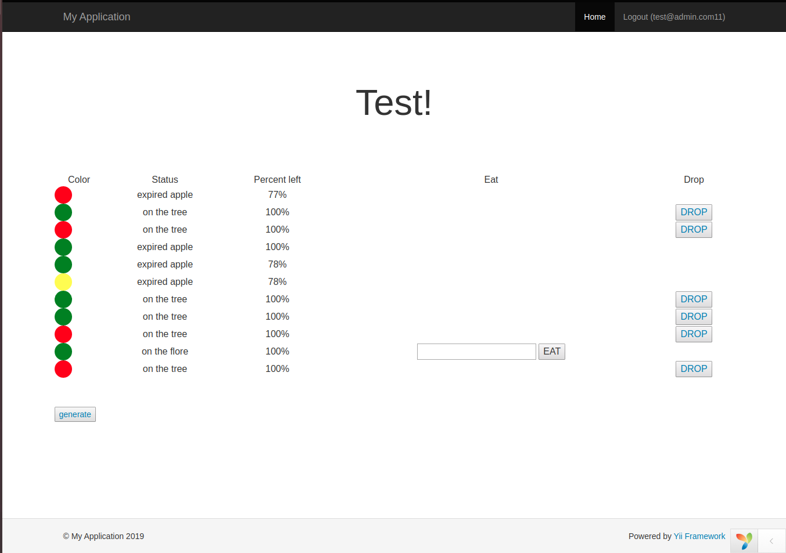

Test Apple 
-------------------

Based on simple Yii2 advanced template

    Deploy

1. pull form git
2. install dependencies via composer
3. set db
4. run ``php -S localhost:8000`` in `baclend/web` directory
5. open browser in localhost:8000
6. create user with sighup
7. login
8. check it

> apple become expired 10 seconds after fall

